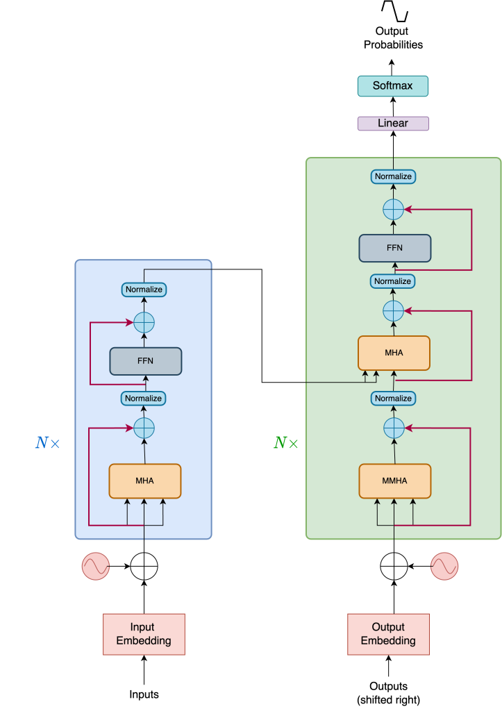

# Understanding Transformers with Tensorflow and Keras
* Most complex systems, ideas and papers can be traced down to: 
<b>"Data, matrix multiplications, repeated and scaled with non-linear switches"</b>
* We started NLP with <b>tokens</b> and then build <b>representations</b> of these tokens.
* Next we use these representations to find similiraties between tokens and we embed them in a hihg-dimensional space.
* After that these embeddings are passed to a model that can process sequential data.
* These models are used to build context and, through an ingenious way, attend to parts of the input sentence that are useful to output sentence in <b>translation</b> 
## Here we will understand the evolution of attention mechanism that led to the seminal architecture of Transformers.
* We will focus on
    - Encoder
    - Decoder

# The Transformer Architecture
* Let's understand it from top-down to build Transformer Architecture.
* The transformer consits of two individual models.
    - Decoder
    - Encoder

